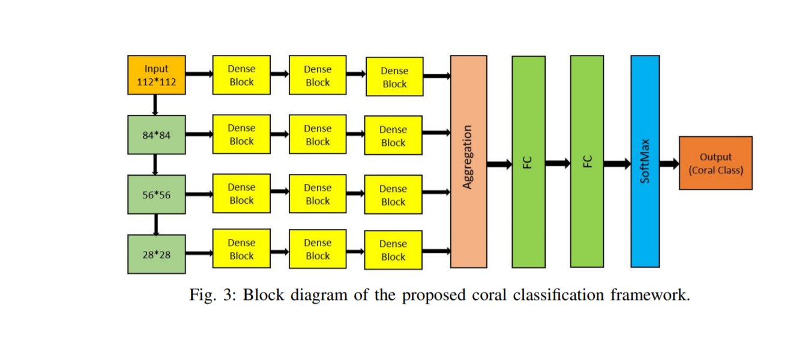

# Patch-Based Image Classification for the Moorea Labeled Coral (MLC) Dataset

In 2012, Beijbom et al. published the MLC dataset to serve as the first large-scale benchmark to gauge the progress of algorithms that perform coral reef image classification. The dataset is comprised of 2,055 images taken of the same sites across three years (2008-2010) with approximately 400,000 manually annotated labels. Outlined with it are three patch-based image classification experiments that use the nine most abundant class categories to test an algorithm’s ability to generalize across time. They set the baseline classification scores for each of the three experiments by using handcrafted feature descriptors that account for both color and texture by using a Maximum Response (MR) filter bank with the Bag of Visual Words (BoVW) algorithm.
    
In 2015, Mahmood et al. surpassed the results published in Beijbom et al. 2012 by using features extracted from the VGGNet using only the pre-trained weights learned from the ImageNet dataset. They incorporated information at multiple scales by using what they termed the ‘Local-Spatial Pyramid Pooling’ technique, which extracted multiple patches of different sizes all centered on the same annotated point, later combining them into a single feature descriptor using a max pooling operation. 
    
The current state-of-the-art for patch-based image classification was created in 2018 by Modasshir et al. They used a custom CNN called the Multipatch Dense Network (MDNet), which learned class categories at multiple scales and adopted the use of densely connected convolutional layers to reduce overfitting (see figure below). This repo contains a Keras implementation of MDNet as specified in the article.

 ### Results   
 
| MLC Benchmark | Experiment 1  | Experiment 2 | Experiment 3 |
| :-------------: | :-------------: | :-------------: | :-------------: |
| Beijbom et al. 2012 | 74.3% | 67.3% | 83.1% | 
| Mahmood et al. 2016 | 77.9% | 70.1% | 84.5% | 
| Modasshir et al. 2018 | 83.4%* | 80.1% | 85.2% |

###### *Experiment 1 uses a 80/20 train/test split
    

### Code
```python
from MDNet import * 

model = build_MDNet( num_classes = 9,
                     img_dim = (112, 112, 3),
                     num_pipelines = 4,
                     num_blocks = 4,
                     num_layers = 5,
                     num_filters = 8,
                     dropout_rate = .5,
                     decrease_by = .25)
```


  
  
 
### References:
* Bejibom et al. 2012, [Automated Annotation of Coral Reef Survey Images](https://www.researchgate.net/publication/261494296_Automated_Annotation_of_Coral_Reef_Survey_Images) 
* Mahmood et al. 2016, [Coral Classification with Hybrid Feature Representations](https://homepages.inf.ed.ac.uk/rbf/PAPERS/icip16.pdf)  
* Modasshir et al. 2018, [MDNet: Multi-Patch Dense Network for Coral Classification](https://afrl.cse.sc.edu/afrl/publications/public_html/papers/ModasshirOceans2018.pdf)  
